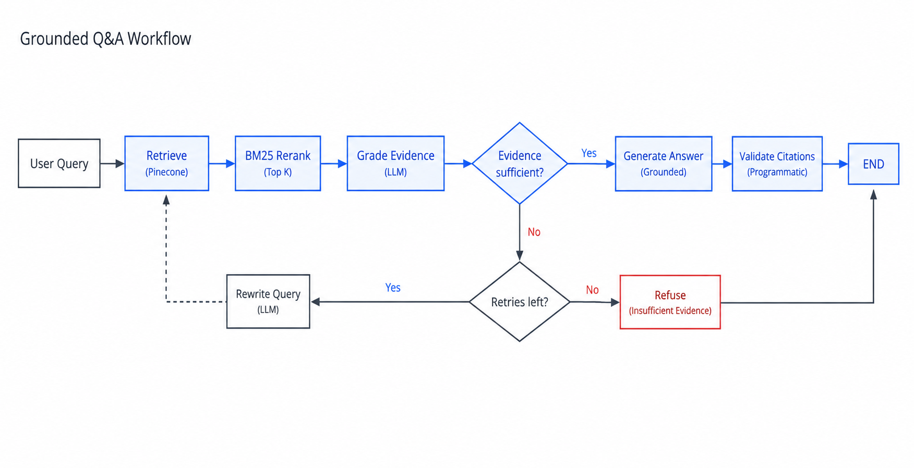

# Legixo Grounded Q&A API

A document-grounded Retrieval-Augmented Generation system — HTTP API plus a
built-in web UI — built for the Legixo Thinklabs Gen AI Intern take-home
assignment.

The system answers questions **only** from a small fictional legal corpus.
If the corpus doesn't contain the answer, it says so explicitly instead of
guessing — every answerable response carries citations pointing at the
exact chunk(s) it came from, and every citation is checked in code against
what was actually retrieved before it's allowed to reach the response.

```
question ──HTTP /ask──> FastAPI ──> LangGraph ──> Pinecone + Groq/Gemini ──> grounded answer + citations
```

See [`docs/architecture.md`](docs/architecture.md) for the module-by-module
design and [`docs/langgraph.md`](docs/langgraph.md) for the graph itself.

## Architecture at a glance

- **Python 3.10+**, **FastAPI** for the HTTP layer, a **vanilla HTML/CSS/JS**
  frontend (no build step) served from the same process
- **LangGraph** `StateGraph` for the retrieve → grade → branch → generate/retry
  workflow (6 nodes, 1 branch, 1 bounded retry loop)
- **Pinecone** (real serverless index) for vector storage
- **Gemini** (`gemini-embedding-001`, via the `google-genai` SDK) for embeddings,
  L2-normalized, with `RETRIEVAL_DOCUMENT`/`RETRIEVAL_QUERY` task types and
  bounded retry/backoff on transient errors
- **Groq** (`llama-3.3-70b-versatile`, via the official `groq` SDK) for grading,
  query rewriting, and answer generation, in JSON mode with built-in retries



## Prerequisites

- Python 3.10 or newer
- API keys for [Google AI Studio / Gemini](https://aistudio.google.com/apikey),
  [Groq](https://console.groq.com/keys), and [Pinecone](https://app.pinecone.io/)
  (all have free tiers sufficient for this project)

## Setup

```bash
git clonehttps://github.com/Ayush8092/legixo-grounded-qa
cd legixo-grounded-qa

python3 -m venv .venv
source .venv/bin/activate        # Windows: .venv\Scripts\activate

pip install -r requirements.txt

cp .env.example .env
# then edit .env and fill in GEMINI_API_KEY, GROQ_API_KEY, PINECONE_API_KEY
```

`.env` is git-ignored — never commit it. `.env.example` contains placeholder
values and inline comments for every setting.

### Configuration reference

| Variable | Default | Meaning |
|---|---|---|
| `GEMINI_API_KEY` | — | Google AI Studio key, used for embeddings |
| `GROQ_API_KEY` | — | Groq key, used for the answer LLM |
| `PINECONE_API_KEY` | — | Pinecone key |
| `PINECONE_INDEX_NAME` | `legixo-grounded-qa` | Serverless index name (created automatically by ingestion if missing) |
| `PINECONE_NAMESPACE` | `legixo-corpus` | Namespace inside the index |
| `PINECONE_CLOUD` / `PINECONE_REGION` | `aws` / `us-east-1` | Serverless spec |
| `PINECONE_READY_TIMEOUT_SECONDS` | `120` | How long ingestion waits for a newly-created index to report ready |
| `EMBEDDING_MODEL` | `gemini-embedding-001` | Gemini embedding model |
| `EMBEDDING_DIMENSION` | `3072` | Must exactly match the Pinecone index dimension — checked automatically at startup/ingestion (see below) |
| `EMBEDDING_MAX_RETRIES` | `5` | Bounded exponential-backoff retries for transient Gemini errors |
| `ANSWER_MODEL` | `llama-3.3-70b-versatile` | Groq chat model |
| `ANSWER_TEMPERATURE` | `0.0` | Keep low/zero for a grounded, deterministic Q&A system |
| `GROQ_MAX_RETRIES` | `3` | Built-in Groq SDK retry attempts |
| `TOP_K` | `5` | Chunks requested per Pinecone query |
| `SCORE_THRESHOLD` | `0.55` | Cosine-similarity floor for a chunk to enter the candidate pool (not the grounding check — see docs/architecture.md) |
| `MAX_RETRIEVAL_LOOPS` | `2` | Bounded retry count in the graph |
| `QUERY_FANOUT` | `3` | Queries generated on the retry (never on the first attempt) |
| `RECURSION_LIMIT` | `20` | Hard LangGraph safety net on top of `MAX_RETRIEVAL_LOOPS` |
| `CORPUS_DIR` | `data/corpus` | Where ingestion reads `*.md` files from |
| `API_HOST` / `API_PORT` / `API_RELOAD` | `127.0.0.1` / `8000` / `true` | Uvicorn server settings |
| `INCLUDE_TRACE` | `false` | Default for whether `/ask` includes the execution trace; overridable per-request with `?trace=true` |

All numeric settings are range-validated at startup (e.g. `TOP_K` must be
1–20, `SCORE_THRESHOLD` 0.0–1.0) — an out-of-range `.env` value fails fast
with a clear Pydantic error rather than causing confusing behavior later.

## Corpus

`data/corpus/` holds six fictional legal-style documents (a matter memo, an
employment agreement excerpt, a hearing notice template, a fictional
statute excerpt, settlement counsel notes, and a lease clause) plus a
`README.txt` describing the corpus. All content is fictional; no real
client or case data is used. **This directory is immutable at runtime** —
`POST /upload` never writes here, and `tests/test_chunking.py::test_only_the_six_known_source_files_appear`
verifies it holds exactly these six files and nothing else.

Runtime-uploaded documents live in a separate directory, `data/uploads/`
(see "Uploading documents" below) — the two are never mixed on disk, which
is what keeps the six-document assignment corpus verifiable independently
of whatever has been uploaded for testing. See `docs/architecture.md`,
"Two knowledge bases, one logical corpus", for the full design.

**Supported formats**: `.md`, `.txt`, `.pdf`, `.docx` — any mix of these in
either directory is ingested together in one run (see `app/loaders.py`).
`README.txt` (and any `README.md`) is corpus metadata, not a knowledge
document, and is never embedded, regardless of format support.

You can add documents either by dropping a file into `data/corpus/`
yourself and re-running ingestion (for the maintainer, editing the shipped
corpus), or via `POST /upload` (for a reviewer, adding runtime documents
without touching the shipped corpus) — both go through the exact same
underlying ingestion pipeline.

## Ingestion

Ingestion is a CLI command (the assignment explicitly disallows a CLI for
*asking* questions, but allows one for ingestion):

```bash
python -m app.ingestion            # idempotent: safe to re-run
python -m app.ingestion --reset    # wipe the namespace first, then ingest fresh
```

Every run ingests **`data/corpus/` and `data/uploads/` together**, in one
pass — not as two separate calls. This matters specifically for
stale-vector reconciliation (below): reconciling the two directories
independently would make each run see the *other* directory's vectors as
absent and delete them as stale. `data/uploads/` not existing yet (a fresh
checkout, before anyone has uploaded anything) contributes zero chunks and
does not error — ingestion behaves exactly as it did before uploads
existed.

The Pinecone index is created automatically on first run if it doesn't
exist yet, at the `EMBEDDING_DIMENSION` configured in `.env`. If an index
with that name already exists at a *different* dimension, ingestion fails
immediately with a clear error telling you exactly what's mismatched,
instead of a confusing Pinecone error surfacing later during a query.

Chunk IDs are deterministic —
`<source_root>::<filename-with-extension>::<section-slug>::<chunk-index>`,
e.g. `corpus::02_employment_agreement_excerpt.md::notice-period::0` — so
re-running ingestion upserts the same vectors in place instead of creating
duplicates. Two things are deliberately baked into that ID:
- `source_root` (`corpus` vs `uploads`) means a file uploaded with the same
  name as an official document never collides with it.
- The *full filename with extension*, not just the stem, means
  `notes.txt` and `notes.docx` never collide even with identical content.

On top of that, **unchanged chunks are skipped entirely** — before
embedding, ingestion checks each chunk's content hash against what's
already stored in Pinecone, and only calls Gemini for chunks that are new
or edited. Edit one section of one document and re-run ingestion: only that
section gets re-embedded.

**Stale-vector cleanup**: deleting a file, or removing a section from a
file that survives, both leave old vectors behind in Pinecone unless
explicitly cleaned up. Every non-`--reset` run also deletes any vector in
the namespace that the current *combined* corpus + uploads no longer
produces — see `docs/architecture.md`, "Stale-vector reconciliation", for
the mechanics and the ownership/safety reasoning (short version: it's
scoped to the configured namespace only, computed across both directories
together, and never uses Pinecone's `delete_all`).

Expected output on a first run:

```
Chunked corpus + uploads -> 12 chunks, 6 files
Embedded + upserted 12 vectors
Namespace now holds 12 vectors
```

...and on an unchanged re-run:

```
Chunked corpus + uploads -> 12 chunks, 6 files
Skipped 12 unchanged chunks (content hash matched Pinecone)
Embedded + upserted 0 vectors
Namespace now holds 12 vectors
```

...and after deleting a file and re-running:

```
Chunked corpus + uploads -> 11 chunks, 5 files
Embedded + upserted 0 vectors
Deleted 1 stale vectors (no longer produced by corpus + uploads):
  - corpus::07_deleted_doc.md::header::0
Namespace now holds 11 vectors
```

## Uploading documents (POST /upload)

Besides the CLI, documents can be added at runtime through the frontend's
"Add documents" panel, or directly:

```bash
curl -F "files=@my_lease.pdf" -F "files=@my_notes.txt" http://127.0.0.1:8000/upload
```

This does not duplicate the ingestion pipeline — accepted files are saved
into `UPLOAD_DIR` (`data/uploads/` by default), **never `CORPUS_DIR`**, and
then `app.ingestion.ingest_corpus()` (the same function the CLI calls, and
which ingests both directories together — see "Ingestion" above) runs.
Uploaded documents are retrievable by `/ask` immediately, and citations
report their real filename, exactly like an official corpus document.

Each file is validated independently (format, filename safety, size limit,
not empty, not corrupt) before anything is ingested, so a bad file in a
batch never blocks the good ones. The response reports exactly which files
were accepted/rejected and why, plus the same chunk/vector counts the CLI
prints:

```json
{
  "status": "partial_success",
  "files": ["my_notes.txt"],
  "rejected": [{"filename": "my_lease.pdf", "error": "my_lease.pdf: could not be read as a PDF (...)"}],
  "chunks_created": 2,
  "vectors_upserted": 2,
  "unchanged_chunks": 0,
  "stale_vectors_deleted": 0,
  "total_chunks": 14,
  "namespace_vector_count": 14
}
```

Because upload and grounding are independent concerns, an uploaded
document is only ever cited when it actually supports the answer — the
same grader and citation-validation pipeline every official-corpus answer
goes through applies identically to uploaded content (see "Citation
behavior" below and `docs/architecture.md`, "Grounding is unaffected by
upload/corpus separation").

See `docs/architecture.md`, "Two knowledge bases, one logical corpus",
"Upload architecture", and "Upload security", for the full design, the
filename-sanitization/size-limit details, and the reconciliation-safety
reasoning.

## Running the API + frontend

```bash
uvicorn app.main:app --reload --host 127.0.0.1 --port 8000
```

Then open **http://127.0.0.1:8000/** for the chat UI, or
**http://127.0.0.1:8000/docs** for interactive Swagger docs.

The frontend (`app/static/`) is plain HTML/CSS/JS with no build step. It
only ever calls this API's own `/health`, `/ready`, and `/ask` endpoints —
never a provider directly, and it never sees an API key. Ask a question,
expand **"Behind the scenes"** to see the actual LangGraph execution path,
the search queries that were tried, and retrieval stats — all parsed live
from the real `trace` the graph produced for that request, not a canned
animation.

### `GET /health` — liveness

Never touches Gemini/Groq/Pinecone; just confirms the process is up.

```bash
curl http://127.0.0.1:8000/health
# {"status": "ok"}
```

### `GET /ready` — readiness

Confirms the service can actually answer a question right now (keys valid,
index exists and ingested). Always returns `200`; check the `ready` field.

```bash
curl http://127.0.0.1:8000/ready
# {"ready": true, "detail": "index=legixo-grounded-qa namespace=legixo-corpus model=llama-3.3-70b-versatile"}
```

### `POST /ask` — answerable question

```bash
curl -X POST http://127.0.0.1:8000/ask \
  -H "Content-Type: application/json" \
  -d '{"question": "What is the notice period at Bluecrest?"}'
```

```json
{
  "answer": "Either party may end the agreement by giving 60 days written notice.",
  "found": true,
  "citations": [
    {
      "chunk_id": "02_employment_agreement_excerpt::notice-period::0",
      "source_file": "02_employment_agreement_excerpt.md",
      "section": "Notice period",
      "snippet": "Document: Employment agreement excerpt — Bluecrest Analytics (fiction) ...",
      "score": 0.83
    }
  ]
}
```

### `POST /ask` — unanswerable question

```bash
curl -X POST http://127.0.0.1:8000/ask \
  -H "Content-Type: application/json" \
  -d '{"question": "What is the population of Riverside city?"}'
```

```json
{
  "answer": "I cannot find the answer to this question in the provided documents.",
  "found": false,
  "citations": []
}
```

### `POST /ask?trace=true` — see the LangGraph execution path

```bash
curl -X POST "http://127.0.0.1:8000/ask?trace=true" \
  -H "Content-Type: application/json" \
  -d '{"question": "What is the notice period at Bluecrest?"}'
```

```json
{
  "answer": "...",
  "found": true,
  "citations": [ ... ],
  "trace": [
    "retrieve: queries=['What is the notice period at Bluecrest?'] -> 3 chunks above score>=0.55 [...]",
    "grade_chunks: sufficient=True relevant=['02_employment_agreement_excerpt::notice-period::0'] reason='...'",
    "generate_answer: found=True cited=['02_employment_agreement_excerpt::notice-period::0']",
    "validate_citations: 1 valid, 0 dropped"
  ]
}
```

You can also always include the trace by default with `INCLUDE_TRACE=true`
in `.env` — the frontend always requests it, so "Behind the scenes" works
regardless of this setting.

### Error responses

`/ask` maps failures to distinct, meaningful status codes rather than a
generic 500 for everything:

| Status | Meaning |
|---|---|
| `422` | Request validation failed (e.g. empty `question`) |
| `503` | Service not ready — index missing (run ingestion) or upstream provider unavailable |
| `500` | Configuration error, or a genuine unexpected bug |

### Postman

Import the running server's OpenAPI schema directly into Postman:
`File → Import → Link → http://127.0.0.1:8000/openapi.json` (with the
server running), or generate a collection from `/docs`.

## Citation behavior

Every answerable response includes one or more citations, each with
`chunk_id`, `source_file`, `section`, `snippet`, and `score`. A citation is
only ever built from a chunk that was **actually retrieved from Pinecone for
that specific request** — the model's claimed citations are validated
against that set in code (`app/llm.py::validate_citations`), so a fabricated
`chunk_id` or `source_file` can never reach the response. If no citation
survives validation, the response is forced to the refusal shape with
`found: false` regardless of what the answer model returned. See
[`docs/langgraph.md`](docs/langgraph.md#where-grounding-is-actually-enforced).

## Testing

Two layers, matching the assignment brief:

```bash
# Unit tests — no API keys required, no network calls
pytest tests/ -q --ignore=tests/test_integration.py

# Integration tests — require real GEMINI_API_KEY, GROQ_API_KEY,
# PINECONE_API_KEY, and a populated Pinecone index (run ingestion first)
pytest tests/test_integration.py -v
```

Running plain `pytest` runs everything; `test_integration.py` skips itself
automatically if the required keys aren't set, so the unit tests are always
safe to run in CI without secrets.

| File | Covers |
|---|---|
| `tests/test_config.py` | `SecretStr` handling, range-validated settings, cached `get_settings()` |
| `tests/test_chunking.py` | Header-aware chunking, deterministic IDs, README exclusion, multi-format corpora |
| `tests/test_loaders.py` | `.md`/`.txt`/`.pdf`/`.docx` extraction, unsupported/corrupt/empty-file errors |
| `tests/test_clients.py` | Embedding normalization, retry/backoff, the Pinecone dimension-mismatch guard |
| `tests/test_retrieval.py` | Score filtering, pooling/dedup across multi-query retry |
| `tests/test_reranker.py` | BM25 reordering, multi-document retention, out-of-corpus passthrough |
| `tests/test_vectorstore.py` | Stale-vector listing/deletion, namespace scoping, graceful degradation |
| `tests/test_citations.py` | The citation guard (`validate_citations`) — fabricated/stale/duplicate IDs |
| `tests/test_routing.py` | The graph's branch decision and loop bound (`route_after_grade`) |
| `tests/test_graph_structure.py` | The `rerank` node's behavior and its place in the graph |
| `tests/test_grading.py` | JSON-mode parsing for grading, rewriting, and answer generation, against a fake Groq client |
| `tests/test_ingestion.py` | Skip-unchanged-chunks logic, `CORPUS_DIR` resolution, stale-vector reconciliation |
| `tests/test_api.py` | FastAPI endpoints (`/health`, `/ready`, `/ask`, `/`), with `QAService` mocked |
| `tests/test_upload_api.py` | `POST /upload` validation, sanitization, size limits, partial-failure reporting |
| `tests/test_eval_scoring.py` | The eval harness's `allowed`/`required` source-file and semantic-keyword scoring |
| `tests/test_integration.py` | End-to-end against real Gemini/Groq/Pinecone |

## Evaluation

`eval/test_cases.json` has 16 questions spanning direct lookups, semantic
paraphrases, numeric figures, similar-but-distinct terminology, a
multi-document question, a partial-information question (topic covered but
the specific detail asked isn't), and out-of-corpus/unrelated questions
that must be refused.

```bash
python -m app.ingestion     # if you haven't already
python -m eval.run_eval
```

This calls the real graph for every question and writes a scored breakdown
to `eval/results.md`, checking answer correctness (expected keywords),
citation correctness (citations point at the expected source files), and
abstention correctness (`found` matches whether the question is actually
answerable).

## Resetting

```bash
python -m app.ingestion --reset
```

Wipes the `legixo-corpus` namespace before re-ingesting (and disables the
unchanged-chunk skip for that run), useful after editing the corpus or the
chunking logic.

## Demo video

*Add a 5–10 minute demo video link here* covering: ingestion (including a
second run showing the unchanged-chunk skip), the frontend UI with an
answerable and an unanswerable question, the "Behind the scenes" trace
panel, `/ready` vs `/health`, and a walkthrough of `app/graph.py`.

## Project structure

```
legixo-grounded-qa/
├── app/
│   ├── config.py       typed, validated settings (.env), SecretStr keys
│   ├── clients.py      Gemini / Groq / Pinecone client factories, retries, dimension guard
│   ├── schemas.py      FastAPI request/response models
│   ├── chunking.py     header-aware, context-rich chunking
│   ├── ingestion.py    corpus -> chunks -> embeddings -> Pinecone (CLI), skip-unchanged
│   ├── vectorstore.py  Pinecone upsert / query / reset / existing-hash lookup
│   ├── retrieval.py    embed + search + score-filter + dedupe
│   ├── llm.py          grading / rewriting / answering / citation guard
│   ├── graph.py         the LangGraph StateGraph + QAService
│   ├── main.py          FastAPI app (lifespan, /health, /ready, /ask, static mount)
│   └── static/          frontend: index.html, styles.css, app.js
├── data/corpus/         the six source documents + README.txt
├── tests/                offline unit tests + one live integration suite
├── eval/                 16-question evaluation harness
└── docs/                 architecture.md, langgraph.md
```

## Engineering principles this project follows

- Never expose or commit API keys; `.env` is git-ignored, keys are `SecretStr`.
- No real legal/client data — the corpus is entirely fictional.
- No outside knowledge and no web search used to answer questions.
- No fabricated citations — enforced in code, not just in the prompt.
- The LangGraph loop is bounded two independent ways and can never run forever.
- Every LangGraph node has one job; nothing is hidden inside a single LLM call.
- Retrieval, grading, and citation validation are each separate, independently testable steps.
- Transient provider errors are retried with backoff, not surfaced as user-facing failures.
- Configuration mistakes (bad values, dimension mismatches) fail fast with a clear message.
- `/health` never depends on external providers; `/ready` tells you the real story.
